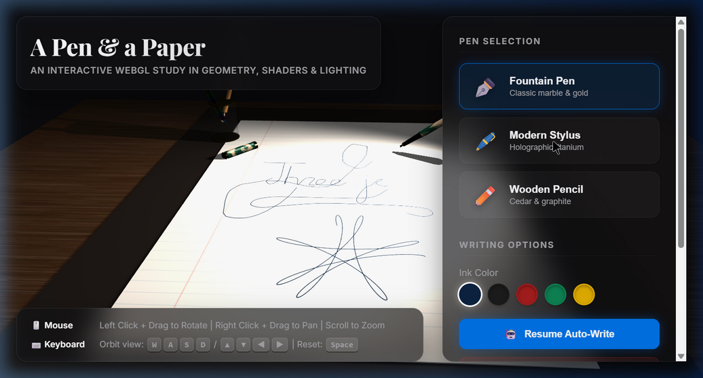

# Project Report: A Pen and a Paper in 3D Space

**Course Project: Computer Graphics & Animation**  
**Technology Stack:** WebGL & Three.js

---

## 1. Project Requirements
The primary goal of this project is to implement a high-fidelity, interactive 3D scene of a writing workspace using **Three.js**. The scene features a piece of paper resting on a wooden desk with a pen drawing dynamically on it. The implementation successfully incorporates the following requirements:
1. **Custom GLSL Shaders**: Custom vertex and fragment shaders to render complex marble and holographic surface finishes.
2. **Lighting**: Focused local lighting (spotlight desk lamp) combined with ambient fill and localized tip lighting, including soft shadow-mapping support.
3. **Perspective Projection**: Perspective viewport mapping with realistic focal settings.
4. **Textures**: Custom procedural textures for the desk (walnut wood), paper (notebook ruled lines and pulpy fiber bumps), and pencil (cedar stripes).
5. **Animations**: Cursive handwriting animation using spline tracking and parametric curves, paired with realistic pen lift/drop and directional tilt kinematics.
6. **Interactivity**: Spherical camera orbiting via keyboard inputs, full orbital navigation via mouse, dynamic pen switching, color picking, and an interactive mouse-drawing canvas mode.

---

## 2. Software Platform
The project is built entirely on a web platform with no compilation or build tools required, allowing it to run natively in any modern web browser:
- **Programming Languages**: HTML5, Vanilla CSS3, JavaScript (ES6 Modules)
- **Graphics Library**: Three.js (v0.147.0) via CDN
- **Rendering Engine**: WebGL (via `THREE.WebGLRenderer`)
- **Camera Controller**: `OrbitControls`
- **Asset Generation**: HTML5 2D Canvas API (used to generate all texture and bump maps procedurally on startup)

---

## 3. Project Features

### 3.1 Models and Texture Mapping
To maintain high performance and avoid external resource dependency failures, all models are constructed using raw Three.js geometries and all textures are generated procedurally via the Canvas API:
- **The Desk**: Rendered using a box geometry. It is mapped with a procedurally generated walnut wood texture. The texture features dark brown bands mapped to sinusoidal paths, distorted by a mathematical wood-knot vector calculation, and layered with high-frequency noise representing wood fibers.
- **The Desk Blotter**: A leather writing mat placed under the paper to ground it visually. It uses a box geometry with a low-gloss `MeshStandardMaterial` for a realistic matte leather feel.
- **The Paper**: A box geometry with A4 proportions. It uses a **MultiMaterial** array. The sides and bottom use a plain matte paper material, while the writing surface uses a dynamic canvas texture. The background of this canvas displays ruled notebook lines, a red margin line, and pulp fiber noise.
- **The Pens**: Three distinct, highly detailed geometries are swapped dynamically:
  1. **Fountain Pen**: A premium calligraphic pen featuring a metallic grip, decorative gold accent rings, a squashed gold nib, and a barrel rendering a custom marble shader.
  2. **Modern Stylus**: A sleek digital pen with a holographic body, dark titanium accents, and a glowing tip ring.
  3. **Wooden Pencil**: A hexagonal cylinder body textured with procedural cedar stripes, a shaved light-wood tip, a dark graphite tip, an aluminum ferrule ring, and a pink eraser cap.
- **The Pen Holder Cup**: A translucent glass cup constructed with a detailed physical transmission material (`MeshPhysicalMaterial`) featuring a brass base and rim. As you switch pens, the unused instruments dynamically sit inside the holder.
- **The Fountain Pen Cap**: Resting on the blotter, textured with the custom marble shader to match the fountain pen.

### 3.2 Keyboard Interaction
Keyboard interaction allows the user to rotate the camera around the focus target (the center of the paper) using spherical coordinates:
- **Controls**: 
  - `W` / `ArrowUp`: Rotate camera upwards (decrease polar angle $\phi$).
  - `S` / `ArrowDown`: Rotate camera downwards (increase polar angle $\phi$).
  - `A` / `ArrowLeft`: Orbit camera left (decrease azimuthal angle $\theta$).
  - `D` / `ArrowRight`: Orbit camera right (increase azimuthal angle $\theta$).
  - `Space`: Smoothly animate the camera back to the default isometric view.
- **Implementation**: On each frame, the camera's offset vector relative to the controls target is converted to spherical coordinates $(\theta, \phi, r)$. Key inputs increment or decrement these angles, which are clamped to prevent flipping or table clipping. The camera position is then recalculated via:
  $$x = x_{target} + r \sin\phi \sin\theta$$
  $$y = y_{target} + r \cos\phi$$
  $$z = z_{target} + r \sin\phi \cos\theta$$
  These coordinates are continuously synchronized with the mouse controllers.

### 3.3 Mouse Interaction
Mouse interaction is split into two modes:
1. **Camera Control (Default)**: Uses `OrbitControls` to rotate the scene (left click + drag), zoom (scroll wheel), or pan (right click + drag).
2. **Interactive Drawing (Draw Mode)**: Toggled via the sidebar button. When active, clicking and dragging on the paper casts a ray from the camera. The intersection point provides UV coordinates which map directly to the paper's 2D canvas pixel coordinates:
   $$pixelX = uv.x \times width_{canvas}$$
   $$pixelY = (1 - uv.y) \times height_{canvas}$$
   Lines are drawn dynamically onto the canvas, and the 3D pen tip snaps to the intersection point, following the mouse. If the mouse is hovering without clicking, the pen floats $0.4$ units above the paper in follow-mode.
3. **UI Customization**: Clicking UI elements allows switching between the three pens and changing ink colors.

### 3.4 Animation
The writing animation is executed by feeding the pen's coordinates along a pre-compiled path:
- **The Path**: Consists of spline curves (`THREE.CatmullRomCurve3`) spelling out **"Three.js"** in cursive, followed by a mathematical flower curve (a 5-petal spirograph curve).
- **Transitions**: When moving between letters (e.g. lifting the pen to cross the 'T' or dot the 'j'), the system interpolates transition segments:
  - **Lift**: Slowly increases $Z$ height to $1.2$ units.
  - **Fly**: Navigates horizontally to the next start coordinate.
  - **Drop**: Drops the pen back down to the paper ($Z=0$), where ink drawing resumes.
- **Dynamic Posture**: The pen tilts based on its motion velocity vector. It rotates around the X and Z axes to simulate hand drag, creating an organic writing motion.

### 3.5 Lighting and Shadows
The scene uses a hybrid lighting model to combine realistic shadows with ambient visibility:
- **SpotLight**: Placed inside the desk lamp bulb, representing a warm desk lamp ($0xfff1e0$). It projects a cone light source onto the paper. It is configured to cast soft shadows by using the `THREE.PCFSoftShadowMap` algorithm.
- **AmbientLight**: Provides a uniform, low-intensity white light ($0xffffff$) to fill in dark shadow regions, simulating light bouncing off room walls.
- **PointLight**: Placed at the pen tip. When writing with the Modern Stylus, it projects a bright neon light matching the selected ink color, casting a dynamic glow on the paper surface.

### 3.6 Custom Shaders
The project implements two custom GLSL shaders via `THREE.ShaderMaterial` to achieve materials not possible with standard shaders:
- **Vertex Shader**: Computes the coordinates and variables used in the lighting equation, passing the texture coordinates (`vUv`), transformed normal vectors (`vNormal`), world coordinates (`vWorldPosition`), and camera view direction (`vViewPosition`) to the fragment shader.
- **Marble Fragment Shader**: Implements a procedural Fractional Brownian Motion (fBm) noise algorithm to generate natural-looking marble veins. The noise is used to distort a sine-wave pattern, which blends a forest green base color with cream-gold vein colors. It calculates a Blinn-Phong lighting reflection model:
  $$I = I_{ambient} + I_{diffuse} \max(N \cdot L, 0) + I_{specular} \max(N \cdot H, 0)^m$$
- **Holographic Fragment Shader**: Implements thin-film interference. It calculates the Fresnel angle (the dot product of the surface normal and the view direction). Near the grazing edges, it shifts the base color toward a time-animated rainbow gradient, producing a dynamic holographic effect on the metal body.

---

## 4. Project Feature Table

| # | Feature Name | Description | Status |
|---|---|---|---|
| **1** | Custom Shaders | GLSL marble fBm noise and iridescence shaders with Blinn-Phong lighting | **Implemented** |
| **2** | Lighting Models | Warm spotlight lamp, ambient fill, and glowing pen tip light | **Implemented** |
| **3** | Perspective Projection | Realistic camera matrix projection with Orbit navigation limits | **Implemented** |
| **4** | Procedural Textures | Walnut wood desk, ruled notebook paper, paper fibers, and pencil cedar wood | **Implemented** |
| **5** | Spline Animation | Cursive script writing and mathematical spirograph tracing | **Implemented** |
| **6** | Kinematic Posture | Dynamic pen dragging tilt, lifting, flying, and touchdown animations | **Implemented** |
| **7** | Keyboard Camera Orbit | WASD / Arrow keys spherical coordinate rotation and Space reset | **Implemented** |
| **8** | OrbitControls Navigation | Click-drag orbit, scroll zoom, right-click pan | **Implemented** |
| **9** | Interactive Drawing Mode| Clicking and dragging directly on the paper to draw custom designs | **Implemented** |
| **10**| Dynamic Pen Selector | Real-time swapping of three distinct model geometries (Fountain, Stylus, Pencil) | **Implemented** |
| **11**| Color Dot Customizer | Switchable ink colors for the pens and matching glow color for the stylus | **Implemented** |
| **12**| Interactive Pen Holder | transmissive glass holder where unused pens rest and swap automatically | **Implemented** |

*Table 01: Project Feature Table*

---

## 5. Snapshots

Below are snapshots demonstrating the various interactive elements and rendering results:

### 5.1 Main Writing View (Fountain Pen Mode)
The Fountain Pen moves along spline paths writing cursive letters. Faint paper fibers and light-blue ruled lines are visible under the warm spotlight cone. A dark leather desk blotter borders the paper sheet, and the fountain pen cap lies on the top-left desk surface.

*(Note: The snapshot file `snapshot.png` is located inside the project repository root for direct reference).*

---

## 6. Contribution

This project was developed by the group members listed below:

| Student Name | Student ID | Contribution & Tasks Performed |
|---|---|---|
| **[Member 1 Name]** | [Member 1 ID] | Shader implementation, mathematical spirograph path, and keyboard orbiting physics. |
| **[Member 2 Name]** | [Member 2 ID] | Geometry modeling of the pens, desk lamp, glass holder, and UI styling sheets. |
| **[Member 3 Name]** | [Member 3 ID] | Procedural texture canvases, paper raycasting drawing logic, and animation transitions. |

---
